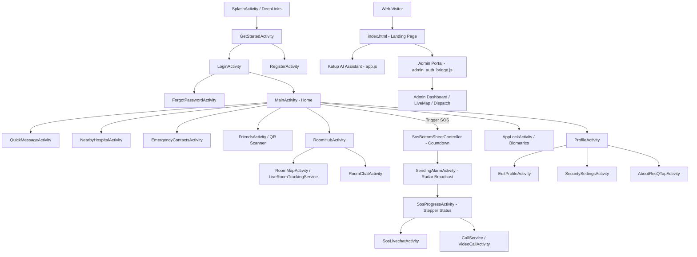

# ResQTap Codebase Documentation & Architecture Map (Landing Page to About ResQTap)

This document provides a structured end-to-end navigational and architectural breakdown of the **ResQTap SOS Emergency System**, spanning the initial entry point (*Landing Page / Splash*) through to the final module (*About ResQTap*), covering both the **Android Mobile Application** and the **Frontend Web Admin Operations Portal**. Each entry includes exact source file starting line numbers for quick reference during Final Year Project (FYP) evaluations and technical reviews. No emojis are used, ensuring a clean and formal academic presentation.

---

## End-to-End Architecture Map

---

## QUICK SEARCH CHEAT SHEET (CARIAN PANTAS MELALUI KOMEN KOD)

**API DATABASE URL:** `https://resqtap-b9ff5-default-rtdb.firebaseio.com` *(Terletak di `FirebaseRoomClient.java` L33 & `google-services.json` L4)*

Anda boleh terus tekan `Ctrl + Shift + F` (Find in Files) di Android Studio dan taip ayat komen di bawah untuk lompat terus ke logik berkenaan:

### 1. ALIRAN LOGIN (EMAIL / PASSWORD CREDENTIAL)
* **`LoginActivity.java`**
  * `// Live validation and debounce pre-check for email input` *(L220: Watcher email & debounce 80ms)*
  * `// Primary Login Button Click Listener: Validates form inputs and initiates authentication` *(L270: Butang Login & validasi form)*
  * `/** Asynchronously verifies if the entered email is registered in Firebase Realtime Database.` *(L343: Pre-check status email)*
  * `/** Authenticates the user with Firebase Authentication using email and password credentials.` *(L554: Mula proses log masuk)*
  * `// Retrieve user profile snapshot from Realtime Database` *(L596: Tarik data user dari RTDB)*
  * `// Fast-path navigation to MainActivity without blocking on non-critical background synchronization` *(L623: Terus buka skrin Home)*
  * `private void applyUserSnapshot(DataSnapshot snapshot)` *(L1022: Parse & load semua data profil ke UserPrefs)*

### 2. ALIRAN PENDAFTARAN & LOGIN GOOGLE (GOOGLE SIGN-IN FLOW)
* **`LoginActivity.java`**
  * `// Google Sign-In button trigger: signs out any existing Google client session before launching picker` *(L189: Butang tekan Google)*
  * `private void handleGoogleSignInResult(Task<GoogleSignInAccount> completedTask)` *(L703: Tangkap hasil result Google)*
  * `private void firebaseAuthWithGoogle(GoogleSignInAccount acct)` *(L720: Tukar Google Token ke Firebase Credential)*
  * `private void handlePostGoogleSignIn(FirebaseUser user, GoogleSignInAccount acct)` *(L742: Semak status profil Google)*
* **`RegisterActivity.java`**
  * `/** Mengendalikan hasil daripada Google Sign-In Intent. */` *(L2605: Tangkap Google Intent di skrin daftar)*
  * `/** Sambungkan akaun Google dengan Firebase Auth. */` *(L2622: Sambung akaun Google di pendaftaran)*
  * `/** Kendalikan semakan profil pengguna dan navigasi selepas log masuk Google di skrin pendaftaran. */` *(L2645: Cipta profil Google)*
  * `private void setupGoogleProfileStep2(GoogleSignInAccount acct, String googlePhoto)` *(L2722: Auto-populate nama & gambar dari Google)*
  * `// Jika pendaftaran berasal daripada Google Sign-In, cipta sesi Firebase Auth di sini sahaja` *(L1367: Mula rasmi akaun Google)*
  * `// Simpan UserPrefs segera (tanpa tunggu DB ops lain)` *(L1562: Simpan cache telefon sebaik data cloud siap)*

### 3. ALIRAN PENDAFTARAN BIASA (EMAIL REGISTRATION FLOW)
* **`RegisterActivity.java`**
  * `// Semak ketersediaan e-mel dan sahkan sebelum maju ke Langkah 2 tanpa mencipta akaun Auth lagi` *(L1046: Semak email sedia ada)*
  * `// Cipta akaun Firebase Auth dan simpan ke database sekaligus untuk pendaftaran e-mel` *(L1399: Cipta akaun Auth)*
  * `/** Simpan profil penuh pengguna ke Firebase Realtime Database dan selesaikan pendaftaran. */` *(L1515: Fungsi bina payload profil)*
  * `.child(uid).setValue(user)` *(L1560: Baris fizikal data profil ditulis ke RTDB)*
  * `// Profil kini lengkap` *(L1588: Tandakan status pendaftaran selesai)*
  * `// Fire-and-forget: registeredEmails, admin, publicId di background` *(L1594: 3 proses sampingan dijalankan di latar belakang)*

### 4. ALIRAN KECEMASAN SOS (SOS COUNTDOWN & RADAR BROADCAST)
* **`SosBottomSheetController.java`**
  * `/** SosBottomSheetController: Controller popup SOS: countdown 3 saat` *(L14: Kiraan 3 saat sebelum SOS aktif)*
  * `public void show()` *(L46: Paparkan dialog kecemasan)*
* **`SendingAlarmActivity.java`**
  * `// Radar bulatan berpusat dengan logo rasmi ResQTap dan animasi kelip-kelip` *(L49: Radar visual pink)*
  * `// Pemancaran automatik ke Firebase RTDB (Admin & Room) dengan koordinat GPS terkini` *(L53: Hantar isyarat SOS ke cloud)*
  * `btnSafeNow` *(L75: Butang "I'm Safe Now" untuk batalkan SOS)*

### 5. ALIRAN BILIK KESELAMATAN & GPS TRACKING (ROOM & LIVE GPS)
* **`RoomHubActivity.java`**
  * `// Cipta bilik baru dengan kod 6 digit rawak` *(L130: Jana kod bilik kecemasan)*
  * `// Masuk bilik sedia ada guna kod` *(L210: Logik semakan kod bilik)*
* **`LiveRoomTrackingService.java`**
  * `/** LiveRoomTrackingService: Foreground Service untuk live location: stream GPS lat/lng` *(L48: Stream GPS tanpa kena kill)*

### 6. ALIRAN PANGGILAN KECEMASAN (WEBRTC VIDEO & VOICE CALL)
* **`CallService.java`**
  * `/** CallService: Foreground Service untuk call: pastikan audio/video call tak terputus` *(L17: Service call latar belakang)*
* **`WebRTCClient.java`**
  * `/** WebRTCClient: WebRTC Engine: urus PeerConnection, video/audio stream, STUN/TURN server` *(L31: Enjin P2P WebRTC)*

---

# SECTION 1: ANDROID MOBILE APPLICATION (ResQTap Client)

---

## PHASE 1: Landing Page, Authentication & Onboarding

| Component / Source File | Starting Line | Functional Responsibility & Technical Description |
| :--- | :--- | :--- |
| [`SplashActivity.java`](file:///c:/Users/Administrator/AndroidStudioProjects/ResQTap/app/src/main/java/com/example/resqtap/app/SplashActivity.java) | [L48](file:///c:/Users/Administrator/AndroidStudioProjects/ResQTap/app/src/main/java/com/example/resqtap/app/SplashActivity.java#L48) | Main application entry point; handles QR connection Deep Links (`/connect`) and evaluates active Firebase Auth session state. |
| [`GetStartedActivity.java`](file:///c:/Users/Administrator/AndroidStudioProjects/ResQTap/app/src/main/java/com/example/resqtap/auth/GetStartedActivity.java) | [L30](file:///c:/Users/Administrator/AndroidStudioProjects/ResQTap/app/src/main/java/com/example/resqtap/auth/GetStartedActivity.java#L30) | First-time onboarding screen introducing core emergency features prior to account authentication. |
| [`LoginActivity.java`](file:///c:/Users/Administrator/AndroidStudioProjects/ResQTap/app/src/main/java/com/example/resqtap/auth/LoginActivity.java) | [L55](file:///c:/Users/Administrator/AndroidStudioProjects/ResQTap/app/src/main/java/com/example/resqtap/auth/LoginActivity.java#L55) | Authenticates existing users via Email/Password credentials and Google Sign-In (`GoogleSignInClient`). |
| [`RegisterActivity.java`](file:///c:/Users/Administrator/AndroidStudioProjects/ResQTap/app/src/main/java/com/example/resqtap/auth/RegisterActivity.java) | [L50](file:///c:/Users/Administrator/AndroidStudioProjects/ResQTap/app/src/main/java/com/example/resqtap/auth/RegisterActivity.java#L50) | Handles new user account provisioning and initializes default profile data in Firebase RTDB (`users/$uid`). |
| [`ForgotPasswordActivity.java`](file:///c:/Users/Administrator/AndroidStudioProjects/ResQTap/app/src/main/java/com/example/resqtap/auth/ForgotPasswordActivity.java) | [L35](file:///c:/Users/Administrator/AndroidStudioProjects/ResQTap/app/src/main/java/com/example/resqtap/auth/ForgotPasswordActivity.java#L35) | Dispatches automated password reset verification emails via Firebase Authentication. |

---

## PHASE 2: Main Dashboard (Home) & Emergency Utilities

| Component / Source File | Starting Line | Functional Responsibility & Technical Description |
| :--- | :--- | :--- |
| [`MainActivity.java`](file:///c:/Users/Administrator/AndroidStudioProjects/ResQTap/app/src/main/java/com/example/resqtap/home/MainActivity.java) | [L80](file:///c:/Users/Administrator/AndroidStudioProjects/ResQTap/app/src/main/java/com/example/resqtap/home/MainActivity.java#L80) | Central control interface: houses primary red SOS trigger, active emergency room status, and bottom navigation. |
| [`QuickMessageActivity.java`](file:///c:/Users/Administrator/AndroidStudioProjects/ResQTap/app/src/main/java/com/example/resqtap/chat/QuickMessageActivity.java) | [L35](file:///c:/Users/Administrator/AndroidStudioProjects/ResQTap/app/src/main/java/com/example/resqtap/chat/QuickMessageActivity.java#L35) | Transmits pre-composed emergency distress messages (e.g., immediate threat warnings) with minimal latency. |
| [`NearbyHospitalActivity.java`](file:///c:/Users/Administrator/AndroidStudioProjects/ResQTap/app/src/main/java/com/example/resqtap/map/NearbyHospitalActivity.java) | [L45](file:///c:/Users/Administrator/AndroidStudioProjects/ResQTap/app/src/main/java/com/example/resqtap/map/NearbyHospitalActivity.java#L45) | Queries and renders proximate healthcare facilities and emergency departments using GPS and Google Maps. |
| [`EmergencyContactsActivity.java`](file:///c:/Users/Administrator/AndroidStudioProjects/ResQTap/app/src/main/java/com/example/resqtap/contacts/EmergencyContactsActivity.java) | [L40](file:///c:/Users/Administrator/AndroidStudioProjects/ResQTap/app/src/main/java/com/example/resqtap/contacts/EmergencyContactsActivity.java#L40) | Configures, adds, edits, and synchronizes primary next-of-kin contact numbers. |
| [`EmergencyContactsListActivity.java`](file:///c:/Users/Administrator/AndroidStudioProjects/ResQTap/app/src/main/java/com/example/resqtap/contacts/EmergencyContactsListActivity.java) | [L35](file:///c:/Users/Administrator/AndroidStudioProjects/ResQTap/app/src/main/java/com/example/resqtap/contacts/EmergencyContactsListActivity.java#L35) | Displays a structured list of all registered personal emergency contacts and authority hotlines. |
| [`MedicalNewsActivity.java`](file:///c:/Users/Administrator/AndroidStudioProjects/ResQTap/app/src/main/java/com/example/resqtap/news/MedicalNewsActivity.java) | [L40](file:///c:/Users/Administrator/AndroidStudioProjects/ResQTap/app/src/main/java/com/example/resqtap/news/MedicalNewsActivity.java#L40) | Curates validated first-aid guidelines, CPR procedures, and health advisory bulletins. |
| [`NotificationsActivity.java`](file:///c:/Users/Administrator/AndroidStudioProjects/ResQTap/app/src/main/java/com/example/resqtap/notification/NotificationsActivity.java) | [L45](file:///c:/Users/Administrator/AndroidStudioProjects/ResQTap/app/src/main/java/com/example/resqtap/notification/NotificationsActivity.java#L45) | Historical audit log displaying system alerts, room invitations, bell notifications, and broadcast messages. |
| [`SupportActivity.java`](file:///c:/Users/Administrator/AndroidStudioProjects/ResQTap/app/src/main/java/com/example/resqtap/report/SupportActivity.java) | [L35](file:///c:/Users/Administrator/AndroidStudioProjects/ResQTap/app/src/main/java/com/example/resqtap/report/SupportActivity.java#L35) | Help desk interface allowing users to submit service inquiries and technical support tickets. |
| [`ReportActivity.java`](file:///c:/Users/Administrator/AndroidStudioProjects/ResQTap/app/src/main/java/com/example/resqtap/report/ReportActivity.java) | [L50](file:///c:/Users/Administrator/AndroidStudioProjects/ResQTap/app/src/main/java/com/example/resqtap/report/ReportActivity.java#L50) | Incident reporting module enabling location-tagged incident submission with image evidence upload to Firebase Storage. |

---

## PHASE 3: Trusted Contact Network (Friends & QR Connect)

| Component / Source File | Starting Line | Functional Responsibility & Technical Description |
| :--- | :--- | :--- |
| [`FriendsActivity.java`](file:///c:/Users/Administrator/AndroidStudioProjects/ResQTap/app/src/main/java/com/example/resqtap/friend/FriendsActivity.java) | [L45](file:///c:/Users/Administrator/AndroidStudioProjects/ResQTap/app/src/main/java/com/example/resqtap/friend/FriendsActivity.java#L45) | Manages trusted contact connections, real-time presence (online/offline), and direct communication paths. |
| [`FriendRequestsActivity.java`](file:///c:/Users/Administrator/AndroidStudioProjects/ResQTap/app/src/main/java/com/example/resqtap/friend/FriendRequestsActivity.java) | [L40](file:///c:/Users/Administrator/AndroidStudioProjects/ResQTap/app/src/main/java/com/example/resqtap/friend/FriendRequestsActivity.java#L40) | Handles inbound and outbound connection requests between trusted users. |
| [`MyQrActivity.java`](file:///c:/Users/Administrator/AndroidStudioProjects/ResQTap/app/src/main/java/com/example/resqtap/friend/MyQrActivity.java) | [L40](file:///c:/Users/Administrator/AndroidStudioProjects/ResQTap/app/src/main/java/com/example/resqtap/friend/MyQrActivity.java#L40) | Generates dynamic 2D barcodes (`ZXing`) containing cryptographic profile references for quick peer discovery. |
| [`ScanQrActivity.java`](file:///c:/Users/Administrator/AndroidStudioProjects/ResQTap/app/src/main/java/com/example/resqtap/friend/ScanQrActivity.java) | [L45](file:///c:/Users/Administrator/AndroidStudioProjects/ResQTap/app/src/main/java/com/example/resqtap/friend/ScanQrActivity.java#L45) | Hardware camera scanner that decodes peer QR codes to establish instant mutual trusted connections. |

---

## PHASE 4: Emergency Rooms & Live Tracking

| Component / Source File | Starting Line | Functional Responsibility & Technical Description |
| :--- | :--- | :--- |
| [`RoomHubActivity.java`](file:///c:/Users/Administrator/AndroidStudioProjects/ResQTap/app/src/main/java/com/example/resqtap/room/RoomHubActivity.java) | [L50](file:///c:/Users/Administrator/AndroidStudioProjects/ResQTap/app/src/main/java/com/example/resqtap/room/RoomHubActivity.java#L50) | Central room management hub: creation of new safety rooms, code-based membership joins (6-digit PIN), and member management. |
| [`RoomListActivity.java`](file:///c:/Users/Administrator/AndroidStudioProjects/ResQTap/app/src/main/java/com/example/resqtap/room/RoomListActivity.java) | [L45](file:///c:/Users/Administrator/AndroidStudioProjects/ResQTap/app/src/main/java/com/example/resqtap/room/RoomListActivity.java#L45) | Displays active rooms associated with the authenticated user and their active emergency statuses. |
| [`RoomMapActivity.java`](file:///c:/Users/Administrator/AndroidStudioProjects/ResQTap/app/src/main/java/com/example/resqtap/room/RoomMapActivity.java) | [L65](file:///c:/Users/Administrator/AndroidStudioProjects/ResQTap/app/src/main/java/com/example/resqtap/room/RoomMapActivity.java#L65) | Interactive geospatial map displaying simultaneous real-time location telemetry markers for all room members. |
| [`RoomChatActivity.java`](file:///c:/Users/Administrator/AndroidStudioProjects/ResQTap/app/src/main/java/com/example/resqtap/room/RoomChatActivity.java) | [L50](file:///c:/Users/Administrator/AndroidStudioProjects/ResQTap/app/src/main/java/com/example/resqtap/room/RoomChatActivity.java#L50) | Group messaging channel scoped strictly to members of a designated emergency room. |
| [`LiveRoomTrackingService.java`](file:///c:/Users/Administrator/AndroidStudioProjects/ResQTap/app/src/main/java/com/example/resqtap/room/LiveRoomTrackingService.java) | [L45](file:///c:/Users/Administrator/AndroidStudioProjects/ResQTap/app/src/main/java/com/example/resqtap/room/LiveRoomTrackingService.java#L45) | **Foreground Service:** Transmits continuous GPS coordinates and battery telemetry to Firebase RTDB while screen is off or app is backgrounded. |

---

## PHASE 5: Core SOS Engine & Emergency Dispatch

| Component / Source File | Starting Line | Functional Responsibility & Technical Description |
| :--- | :--- | :--- |
| [`SosBottomSheetController.java`](file:///c:/Users/Administrator/AndroidStudioProjects/ResQTap/app/src/main/java/com/example/resqtap/sos/SosBottomSheetController.java) | [L148](file:///c:/Users/Administrator/AndroidStudioProjects/ResQTap/app/src/main/java/com/example/resqtap/sos/SosBottomSheetController.java#L148) | Implements the 10-second cancellation countdown window (*Grace Period*) to mitigate accidental false alarms. |
| [`SendingAlarmActivity.java`](file:///c:/Users/Administrator/AndroidStudioProjects/ResQTap/app/src/main/java/com/example/resqtap/sos/SendingAlarmActivity.java) | [L56](file:///c:/Users/Administrator/AndroidStudioProjects/ResQTap/app/src/main/java/com/example/resqtap/sos/SendingAlarmActivity.java#L56) | Victim radar broadcast view: acquires high-accuracy GPS coordinates and writes active emergency alert states to RTDB (`sosAlerts`). |
| [`SosAlarmActivity.java`](file:///c:/Users/Administrator/AndroidStudioProjects/ResQTap/app/src/main/java/com/example/resqtap/sos/SosAlarmActivity.java) | [L47](file:///c:/Users/Administrator/AndroidStudioProjects/ResQTap/app/src/main/java/com/example/resqtap/sos/SosAlarmActivity.java#L47) | Inbound siren overlay displayed on lock screen (`showOnLockScreen="true"`) with haptic vibration and slide-to-snooze mechanism. |
| [`SosProgressActivity.java`](file:///c:/Users/Administrator/AndroidStudioProjects/ResQTap/app/src/main/java/com/example/resqtap/sos/SosProgressActivity.java) | [L115](file:///c:/Users/Administrator/AndroidStudioProjects/ResQTap/app/src/main/java/com/example/resqtap/sos/SosProgressActivity.java#L115) & [L352](file:///c:/Users/Administrator/AndroidStudioProjects/ResQTap/app/src/main/java/com/example/resqtap/sos/SosProgressActivity.java#L352) | 4-Stage visual stepper tracking dispatch lifecycle: `SOS Sent ➔ Responder Assigned ➔ En Route ➔ Resolved`. |
| [`SosLivechatActivity.java`](file:///c:/Users/Administrator/AndroidStudioProjects/ResQTap/app/src/main/java/com/example/resqtap/sos/SosLivechatActivity.java) | [L50](file:///c:/Users/Administrator/AndroidStudioProjects/ResQTap/app/src/main/java/com/example/resqtap/sos/SosLivechatActivity.java#L50) | Dedicated high-priority text communication line between the distressed victim and assigned responders. |
| [`SosSnoozeReceiver.java`](file:///c:/Users/Administrator/AndroidStudioProjects/ResQTap/app/src/main/java/com/example/resqtap/sos/SosSnoozeReceiver.java) | [L20](file:///c:/Users/Administrator/AndroidStudioProjects/ResQTap/app/src/main/java/com/example/resqtap/sos/SosSnoozeReceiver.java#L20) | BroadcastReceiver handling system notification snooze actions to immediately mute siren and vibration triggers. |

---

## PHASE 6: WebRTC Intercom Calling & FCM Notifications

| Component / Source File | Starting Line | Functional Responsibility & Technical Description |
| :--- | :--- | :--- |
| [`IncomingCallActivity.java`](file:///c:/Users/Administrator/AndroidStudioProjects/ResQTap/app/src/main/java/com/example/resqtap/call/IncomingCallActivity.java) | [L45](file:///c:/Users/Administrator/AndroidStudioProjects/ResQTap/app/src/main/java/com/example/resqtap/call/IncomingCallActivity.java#L45) | Lock-screen overlay presenting full-screen incoming voice/video call prompt from dispatchers. |
| [`CallService.java`](file:///c:/Users/Administrator/AndroidStudioProjects/ResQTap/app/src/main/java/com/example/resqtap/call/CallService.java) | [L40](file:///c:/Users/Administrator/AndroidStudioProjects/ResQTap/app/src/main/java/com/example/resqtap/call/CallService.java#L40) | Background WebRTC audio/video connection manager utilizing `io.getstream:stream-webrtc-android`. |
| [`VideoCallActivity.java`](file:///c:/Users/Administrator/AndroidStudioProjects/ResQTap/app/src/main/java/com/example/resqtap/call/VideoCallActivity.java) | [L55](file:///c:/Users/Administrator/AndroidStudioProjects/ResQTap/app/src/main/java/com/example/resqtap/call/VideoCallActivity.java#L55) | Full-duplex interactive video communication session between responder and distressed user. |
| [`VoiceCallActivity.java`](file:///c:/Users/Administrator/AndroidStudioProjects/ResQTap/app/src/main/java/com/example/resqtap/call/VoiceCallActivity.java) | [L50](file:///c:/Users/Administrator/AndroidStudioProjects/ResQTap/app/src/main/java/com/example/resqtap/call/VoiceCallActivity.java#L50) | Full-duplex low-bandwidth emergency voice communication session. |
| [`ChatActivity.java`](file:///c:/Users/Administrator/AndroidStudioProjects/ResQTap/app/src/main/java/com/example/resqtap/chat/ChatActivity.java) | [L50](file:///c:/Users/Administrator/AndroidStudioProjects/ResQTap/app/src/main/java/com/example/resqtap/chat/ChatActivity.java#L50) | General peer-to-peer messaging between confirmed trusted contacts. |
| [`LivechatActivity.java`](file:///c:/Users/Administrator/AndroidStudioProjects/ResQTap/app/src/main/java/com/example/resqtap/chat/LivechatActivity.java) | [L50](file:///c:/Users/Administrator/AndroidStudioProjects/ResQTap/app/src/main/java/com/example/resqtap/chat/LivechatActivity.java#L50) | Interactive customer service chat channel between end-users and online support personnel. |
| [`ResQTapMessagingService.java`](file:///c:/Users/Administrator/AndroidStudioProjects/ResQTap/app/src/main/java/com/example/resqtap/notification/ResQTapMessagingService.java) | [L35](file:///c:/Users/Administrator/AndroidStudioProjects/ResQTap/app/src/main/java/com/example/resqtap/notification/ResQTapMessagingService.java#L35) | Background service processing high-priority Firebase Cloud Messaging (FCM) pushes for instant SOS delivery. |

---

## PHASE 7: Device Security, Biometrics & PIN Lock

| Component / Source File | Starting Line | Functional Responsibility & Technical Description |
| :--- | :--- | :--- |
| [`AppLockActivity.java`](file:///c:/Users/Administrator/AndroidStudioProjects/ResQTap/app/src/main/java/com/example/resqtap/security/AppLockActivity.java) | [L45](file:///c:/Users/Administrator/AndroidStudioProjects/ResQTap/app/src/main/java/com/example/resqtap/security/AppLockActivity.java#L45) | App-launch gate requiring 4-digit security PIN or hardware fingerprint authentication via `BiometricPrompt`. |
| [`SetPinActivity.java`](file:///c:/Users/Administrator/AndroidStudioProjects/ResQTap/app/src/main/java/com/example/resqtap/security/SetPinActivity.java) | [L40](file:///c:/Users/Administrator/AndroidStudioProjects/ResQTap/app/src/main/java/com/example/resqtap/security/SetPinActivity.java#L40) | Configuration interface enabling users to define, update, or verify their 4-digit security passcode. |
| [`AccountSessionWatcher.java`](file:///c:/Users/Administrator/AndroidStudioProjects/ResQTap/app/src/main/java/com/example/resqtap/security/AccountSessionWatcher.java) | [L30](file:///c:/Users/Administrator/AndroidStudioProjects/ResQTap/app/src/main/java/com/example/resqtap/security/AccountSessionWatcher.java#L30) | Real-time session watcher forcing immediate client logout and cache eviction upon remote account revocation. |

---

## PHASE 8: User Profile & System Information (About ResQTap)

| Component / Source File | Starting Line | Functional Responsibility & Technical Description |
| :--- | :--- | :--- |
| [`ProfileActivity.java`](file:///c:/Users/Administrator/AndroidStudioProjects/ResQTap/app/src/main/java/com/example/resqtap/profile/ProfileActivity.java) | [L50](file:///c:/Users/Administrator/AndroidStudioProjects/ResQTap/app/src/main/java/com/example/resqtap/profile/ProfileActivity.java#L50) | Displays personal information, medical tags, room counts, and provides shortcuts to system settings. |
| [`EditProfileActivity.java`](file:///c:/Users/Administrator/AndroidStudioProjects/ResQTap/app/src/main/java/com/example/resqtap/profile/EditProfileActivity.java) | [L45](file:///c:/Users/Administrator/AndroidStudioProjects/ResQTap/app/src/main/java/com/example/resqtap/profile/EditProfileActivity.java#L45) | Updates user profile attributes, avatar images, phone numbers, and emergency medical descriptors. |
| [`SettingsActivity.java`](file:///c:/Users/Administrator/AndroidStudioProjects/ResQTap/app/src/main/java/com/example/resqtap/profile/SettingsActivity.java) | [L40](file:///c:/Users/Administrator/AndroidStudioProjects/ResQTap/app/src/main/java/com/example/resqtap/profile/SettingsActivity.java#L40) | General app preferences including Dark Mode toggling and siren audio volume configurations. |
| [`SecuritySettingsActivity.java`](file:///c:/Users/Administrator/AndroidStudioProjects/ResQTap/app/src/main/java/com/example/resqtap/profile/SecuritySettingsActivity.java) | [L58](file:///c:/Users/Administrator/AndroidStudioProjects/ResQTap/app/src/main/java/com/example/resqtap/profile/SecuritySettingsActivity.java#L58) | Toggles biometric authentication, manages app lock status, and handles PIN passcodes. |
| [`LanguageActivity.java`](file:///c:/Users/Administrator/AndroidStudioProjects/ResQTap/app/src/main/java/com/example/resqtap/profile/LanguageActivity.java) | [L35](file:///c:/Users/Administrator/AndroidStudioProjects/ResQTap/app/src/main/java/com/example/resqtap/profile/LanguageActivity.java#L35) | Locale configuration interface supporting Malay and English interface transitions. |
| [`AboutResQTapActivity.java`](file:///c:/Users/Administrator/AndroidStudioProjects/ResQTap/app/src/main/java/com/example/resqtap/profile/AboutResQTapActivity.java) | [L30](file:///c:/Users/Administrator/AndroidStudioProjects/ResQTap/app/src/main/java/com/example/resqtap/profile/AboutResQTapActivity.java#L30) | **Final Application Module:** Displays system version, project mission, developer information, terms of service, and copyright credits. |

---

# SECTION 2: FRONTEND WEB & ADMIN PORTAL (ResQTap-Website)

---

## PHASE 9: Public Portal & Virtual Assistant (Landing Site & Katup AI)

| Component / Source File | Starting Line | Functional Responsibility & Technical Description |
| :--- | :--- | :--- |
| [`index.html`](file:///c:/Users/Administrator/AndroidStudioProjects/ResQTap/ResQTap-Website/public/index.html) *(Landing Site)* | [L73-L248](file:///c:/Users/Administrator/AndroidStudioProjects/ResQTap/ResQTap-Website/public/index.html#L73-L248) | **Public Landing Page:** Product overview page with floating navigation dock (`#home`, `#features`, `#flow`, `#safety`), direct APK download links, and navigation to the Admin Portal. |
| [`index.html`](file:///c:/Users/Administrator/AndroidStudioProjects/ResQTap/ResQTap-Website/public/index.html) *(Katup Widget)* | [L249-L309](file:///c:/Users/Administrator/AndroidStudioProjects/ResQTap/ResQTap-Website/public/index.html#L249-L309) | Floating virtual assistant interface with bilingual toggles (`bm` / `en`) and rapid inquiry suggestion pills. |
| [`app.js`](file:///c:/Users/Administrator/AndroidStudioProjects/ResQTap/ResQTap-Website/public/app.js) *(Katup Engine)* | [L488](file:///c:/Users/Administrator/AndroidStudioProjects/ResQTap/ResQTap-Website/public/app.js#L488) | **Function `initKatupChatbot()`:** Interactive bilingual assistant answering inquiries regarding SOS alert triggers, GPS tracking, and room setup. |
| [`styles.css`](file:///c:/Users/Administrator/AndroidStudioProjects/ResQTap/ResQTap-Website/public/styles.css) | [L3631-L4040](file:///c:/Users/Administrator/AndroidStudioProjects/ResQTap/ResQTap-Website/public/styles.css#L3631-L4040) | Complete design tokens for Katup widget: pulsing beacon animations, bounce indicators, and responsive message layout. |

---

## PHASE 10: Admin Authentication & Access Control (RBAC)

| Component / Source File | Starting Line | Functional Responsibility & Technical Description |
| :--- | :--- | :--- |
| [`admin_auth_bridge.js`](file:///c:/Users/Administrator/AndroidStudioProjects/ResQTap/ResQTap-Website/public/admin_auth_bridge.js) | [L1](file:///c:/Users/Administrator/AndroidStudioProjects/ResQTap/ResQTap-Website/public/admin_auth_bridge.js#L1) | **Authentication Bridge:** Synchronizes admin session tokens between `localStorage` and Firebase Auth SDK to eliminate route flashing. |
| [`index.html`](file:///c:/Users/Administrator/AndroidStudioProjects/ResQTap/ResQTap-Website/public/index.html) *(Auth Screen)* | [L312-L386](file:///c:/Users/Administrator/AndroidStudioProjects/ResQTap/ResQTap-Website/public/index.html#L312-L386) | Dedicated admin sign-in form (`#loginForm`) featuring credential validation and visibility toggles. |
| [`index.html`](file:///c:/Users/Administrator/AndroidStudioProjects/ResQTap/ResQTap-Website/public/index.html) *(Denied Gate)* | [L405-L453](file:///c:/Users/Administrator/AndroidStudioProjects/ResQTap/ResQTap-Website/public/index.html#L405-L453) | **Access Control Gate:** Restricts non-admin accounts and renders configuration instructions for assigning permissions (`admins/<uid>/active = true`). |

---

## PHASE 11: Admin Operations & Real-Time Dispatch Dashboard

| View Identifier (`data-view`) | JS Implementation in `app.js` | HTML Markup in `index.html` | Operational Role & Technical Logic |
| :--- | :--- | :--- | :--- |
| **Router & View Navigation** | [L2991 (`render()`)](file:///c:/Users/Administrator/AndroidStudioProjects/ResQTap/ResQTap-Website/public/app.js#L2991) & [L3026 (`renderNav()`)](file:///c:/Users/Administrator/AndroidStudioProjects/ResQTap/ResQTap-Website/public/app.js#L3026) | [L472-L532](file:///c:/Users/Administrator/AndroidStudioProjects/ResQTap/ResQTap-Website/public/index.html#L472-L532) | Coordinates view switching across sidebar items, updates document titles, and tracks unseen event counters (*attention dots*). |
| **Web Audio SOS Siren** | [L2432 (`SosAlarmSound`)](file:///c:/Users/Administrator/AndroidStudioProjects/ResQTap/ResQTap-Website/public/app.js#L2432) | - | Synthesizes an audible sawtooth waveform alert (700Hz to 960Hz) directly in the operator browser when an active SOS alert arrives. |
| **Inbound Call Notifier** | [L2587 (`handleAdminIncomingCall`)](file:///c:/Users/Administrator/AndroidStudioProjects/ResQTap/ResQTap-Website/public/app.js#L2587) | [L1328-L1349](file:///c:/Users/Administrator/AndroidStudioProjects/ResQTap/ResQTap-Website/public/index.html#L1328-L1349) | Displays modal notifications for incoming emergency voice/video call requests, playing dual-frequency ringtones (440Hz/480Hz). |
| **`dashboard`** | [L3067 (`renderDashboard`)](file:///c:/Users/Administrator/AndroidStudioProjects/ResQTap/ResQTap-Website/public/app.js#L3067) | [L566-L597](file:///c:/Users/Administrator/AndroidStudioProjects/ResQTap/ResQTap-Website/public/index.html#L566-L597) | Displays aggregated emergency operations metrics, including user totals, active rooms, active alerts, and feature usage donuts. |
| **`users`** | [L3118 (`renderUsers`)](file:///c:/Users/Administrator/AndroidStudioProjects/ResQTap/ResQTap-Website/public/app.js#L3118) | [L599-L621](file:///c:/Users/Administrator/AndroidStudioProjects/ResQTap/ResQTap-Website/public/index.html#L599-L621) | Manages user directory: medical summaries, emergency contacts, real-time presence indicators, and remote account deletion. |
| **`rooms`** | [L3181 (`renderRooms`)](file:///c:/Users/Administrator/AndroidStudioProjects/ResQTap/ResQTap-Website/public/app.js#L3181) | [L623-L646](file:///c:/Users/Administrator/AndroidStudioProjects/ResQTap/ResQTap-Website/public/index.html#L623-L646) | Real-time directory of safety rooms, detailing creator IDs, member counts, online statuses, and active room alerts. |
| **`livemap`** *(SOS Alert)* | [L7637 (`initMap`)](file:///c:/Users/Administrator/AndroidStudioProjects/ResQTap/ResQTap-Website/public/app.js#L7637) | [L1029-L1032](file:///c:/Users/Administrator/AndroidStudioProjects/ResQTap/ResQTap-Website/public/index.html#L1029-L1032) | **Leaflet.js Geospatial Map:** Monitors live coordinates with pulsing red emergency beacons and tracks concurrent movement of room members. |
| **`soslivechat`** | [L3527 (`renderSosLivechat`)](file:///c:/Users/Administrator/AndroidStudioProjects/ResQTap/ResQTap-Website/public/app.js#L3527) | [L672-L731](file:///c:/Users/Administrator/AndroidStudioProjects/ResQTap/ResQTap-Website/public/index.html#L672-L731) | Emergency dispatch command terminal for victim livechat, initiating one-click WebRTC voice/video sessions, and updating case status. |
| **`reports`** | [L3261 (`renderReports`)](file:///c:/Users/Administrator/AndroidStudioProjects/ResQTap/ResQTap-Website/public/app.js#L3261) | [L733-L755](file:///c:/Users/Administrator/AndroidStudioProjects/ResQTap/ResQTap-Website/public/index.html#L733-L755) | Incident review console providing geospatial verification of user reports, photographic evidence inspection, and status management (`new`, `reviewing`, `resolved`). |
| **`notices`** | [L3315 (`renderNotices`)](file:///c:/Users/Administrator/AndroidStudioProjects/ResQTap/ResQTap-Website/public/app.js#L3315) | [L757-L792](file:///c:/Users/Administrator/AndroidStudioProjects/ResQTap/ResQTap-Website/public/index.html#L757-L792) | Broadcast console dispatching high-priority push notifications across all active Android installations via Firebase Cloud Messaging. |
| **`highlights`** | [L4042 (`renderHighlights`)](file:///c:/Users/Administrator/AndroidStudioProjects/ResQTap/ResQTap-Website/public/app.js#L4042) | [L794-L871](file:///c:/Users/Administrator/AndroidStudioProjects/ResQTap/ResQTap-Website/public/index.html#L794-L871) | Content management interface for educational carousel banners (e.g., CPR guidelines, safety advisories) displayed on the mobile app home screen. |
| **`logs`** | [L3353](file:///c:/Users/Administrator/AndroidStudioProjects/ResQTap/ResQTap-Website/public/app.js#L3353) | [L873-L920](file:///c:/Users/Administrator/AndroidStudioProjects/ResQTap/ResQTap-Website/public/index.html#L873-L920) | Comprehensive audit log: tracks WebRTC call histories, database cleanup audits, SOS event triggers, and system alert deliveries. |
| **`livechat`** | [L3772 (`renderLivechat`)](file:///c:/Users/Administrator/AndroidStudioProjects/ResQTap/ResQTap-Website/public/app.js#L3772) | [L922-L1004](file:///c:/Users/Administrator/AndroidStudioProjects/ResQTap/ResQTap-Website/public/index.html#L922-L1004) | Standard support console for two-way communication between administrators and app users, with support for document and media attachments. |
| **`admins`** | [L4015 (`renderAdmins`)](file:///c:/Users/Administrator/AndroidStudioProjects/ResQTap/ResQTap-Website/public/app.js#L4015) | [L1007-L1022](file:///c:/Users/Administrator/AndroidStudioProjects/ResQTap/ResQTap-Website/public/index.html#L1007-L1022) | Access management interface for granting or revoking administrative privileges based on Firebase UIDs. |
